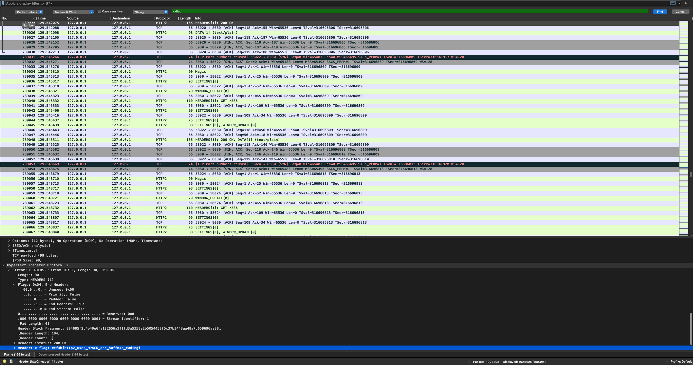

# H2: 248 team solved

## Description

69 pt, easy

author:xrekkusu

バージョン2です。

## SOLUTIONS

ソースコードから、あるパケットのheaderに`x-flag`が存在すると予想しました。
Wiresharkの`Edit` -> `Find Packet`を選択し`Packet details`で`x-flag`と検索するとフラグがでてきました。


```go
const SECRET_PATH = "<secret>"

func main() {
  handler := http.HandlerFunc(func(w http.ResponseWriter, r *http.Request) {
    if r.URL.Path == SECRET_PATH {
      w.Header().Set("x-flag", "<secret>")
    }
    w.WriteHeader(200)
    fmt.Fprintf(w, "Can you find the flag?\n")
  })

  h2s := &http2.Server{}
  h1s := &http.Server{
    Addr:    ":8080",
    Handler: h2c.NewHandler(handler, h2s),
  }

  log.Fatal(h1s.ListenAndServe())
}
```




## FLAG

```
ctf4b{http2_uses_HPACK_and_huffm4n_c0ding}
```

## REF

https://unit42.paloaltonetworks.jp/using-wireshark-exporting-objects-from-a-pcap/
