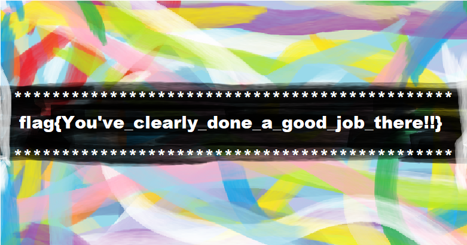

# Forensics

## paint_flag:50

要調査対象者の端末からあるファイルを押収することに成功しました。どうやら外部の協力者に機密データを送ろうとしたようです。組織内の監視網をかいくぐるため、一見すると機密データが含まれていなかのように加工がされているようです。ファイルを解析して機密データを取得してください。

添付されたファイルを解析し、フラグを入手してください。

### writeup

docsファイルを開くと画像にフラグが書かれていましたが、編集により{}の中が伏せられていました。図として保存し、開いてカラーバランスを変えても見えませんでした。
stringsコマンドを使うと中にflag.pngがあることが分かりました。

```bash
$ strings paint_flag.docx | grep flag
word/media/flag.png
word/media/flag.pngPK
```

そこで、binwalkを使って全てのファイルを取り出してみました。すると、`word/media/flag.png`にフラグが伏せられていない状態のフラグが出てきました。

```bash
$ binwalk -e ./paint_flag.docx

DECIMAL       HEXADECIMAL     DESCRIPTION
--------------------------------------------------------------------------------
0             0x0             Zip archive data, at least v2.0 to extract, compressed size: 344, uncompressed size: 663, name: docProps/app.xml
410           0x19A           Zip archive data, at least v2.0 to extract, compressed size: 342, uncompressed size: 675, name: docProps/core.xml
852           0x354           Zip archive data, at least v2.0 to extract, compressed size: 1433, uncompressed size: 5780, name: word/document.xml
2332          0x91C           Zip archive data, at least v2.0 to extract, compressed size: 573, uncompressed size: 1933, name: word/fontTable.xml
2953          0xB89           Zip archive data, at least v2.0 to extract, compressed size: 215965, uncompressed size: 216319, name: word/media/flag.png
218967        0x35757         Zip archive data, at least v2.0 to extract, compressed size: 247808, uncompressed size: 247926, name: word/media/image1.png
466826        0x71F8A         Zip archive data, at least v2.0 to extract, compressed size: 1087, uncompressed size: 3153, name: word/settings.xml
467960        0x723F8         Zip archive data, at least v2.0 to extract, compressed size: 2772, uncompressed size: 29484, name: word/styles.xml
470777        0x72EF9         Zip archive data, at least v2.0 to extract, compressed size: 1688, uncompressed size: 8407, name: word/theme/theme1.xml
472516        0x735C4         Zip archive data, at least v2.0 to extract, compressed size: 328, uncompressed size: 894, name: word/webSettings.xml
472894        0x7373E         Zip archive data, at least v2.0 to extract, compressed size: 256, uncompressed size: 949, name: word/_rels/document.xml.rels
473208        0x73878         Zip archive data, at least v2.0 to extract, compressed size: 346, uncompressed size: 1362, name: [Content_Types].xml
473603        0x73A03         Zip archive data, at least v2.0 to extract, compressed size: 233, uncompressed size: 590, name: _rels/.rels
474714        0x73E5A         End of Zip archive, footer length: 22
```


### FLAG

flag{What_m4tters_is_inside;)}

## Mail:50
あなたはメールデータの調査を依頼されました。組織内の要員が規定に反して組織内のデータを個人利用のクラウドサービスにバックアップとしてコピーしていたもののようです。メールデータに機密情報が含まれていないか、調査してください。

添付されたファイルを解析し、フラグを得てください。

### writeup

配布されたファイルにSent-1がありました。
そこに大量の文字列があり、その上に"kimitsu.zip"と書かれており、base64でエンコードされてました。
そこで、Cyberchefでbase64でデコードした後、「Save output to file」でzipファイルとして保存し解凍するとフラグが書かれた画像ファイルが出てきました。

```
This is a multi-part message in MIME format.
--------------5F58B5ABAAA48BBDE3549928
Content-Type: text/plain; charset=utf-8; format=flowed
Content-Transfer-Encoding: 8bit

アカリさん

ステラです。

　サーバから依頼のあったファイルを取得しておきました。
　メールに添付いたしますので、ご確認ください。

以上です。

--------------5F58B5ABAAA48BBDE3549928
Content-Type: application/x-zip-compressed;
 name="kimitsu.zip"
Content-Transfer-Encoding: base64
Content-Disposition: attachment;
 filename="kimitsu.zip"

UEsDBBQAAAAIAEKk8lIYGu97DhgHAG8YBwALAAAAZ29vZGpvYi5wbmdUumN3JUy0Rrtj27Zt
(省略)
```

https://gchq.github.io/CyberChef/#recipe=From_Base64('A-Za-z0-9%2B/%3D',true,false)



### FLAG

flag{You've_clearly_done_a_good_job_there!!}
